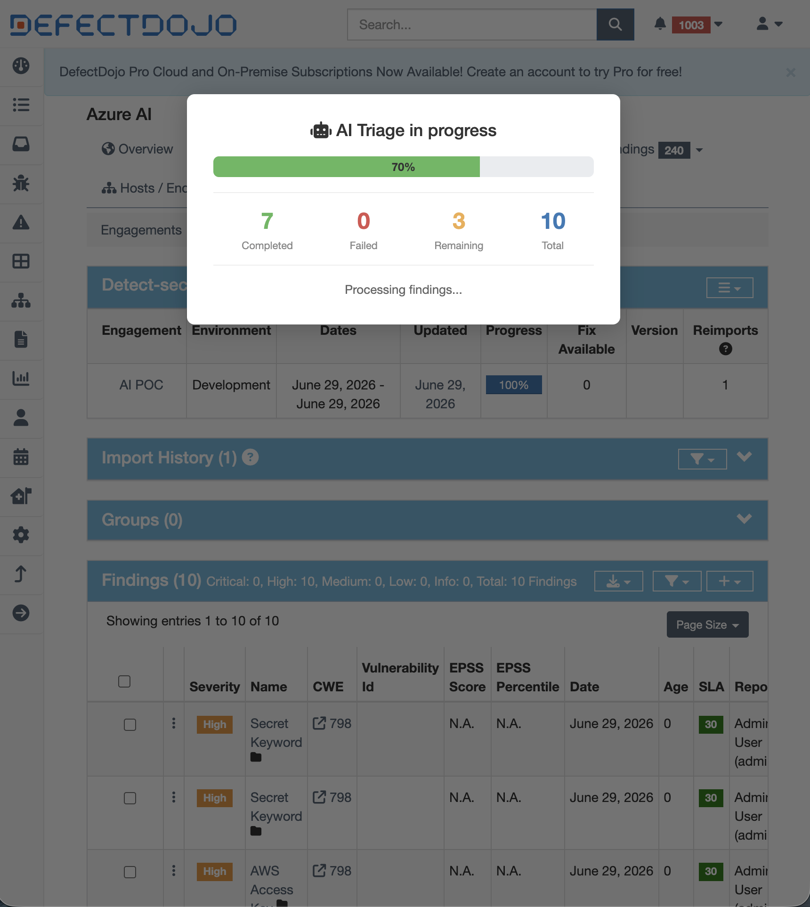
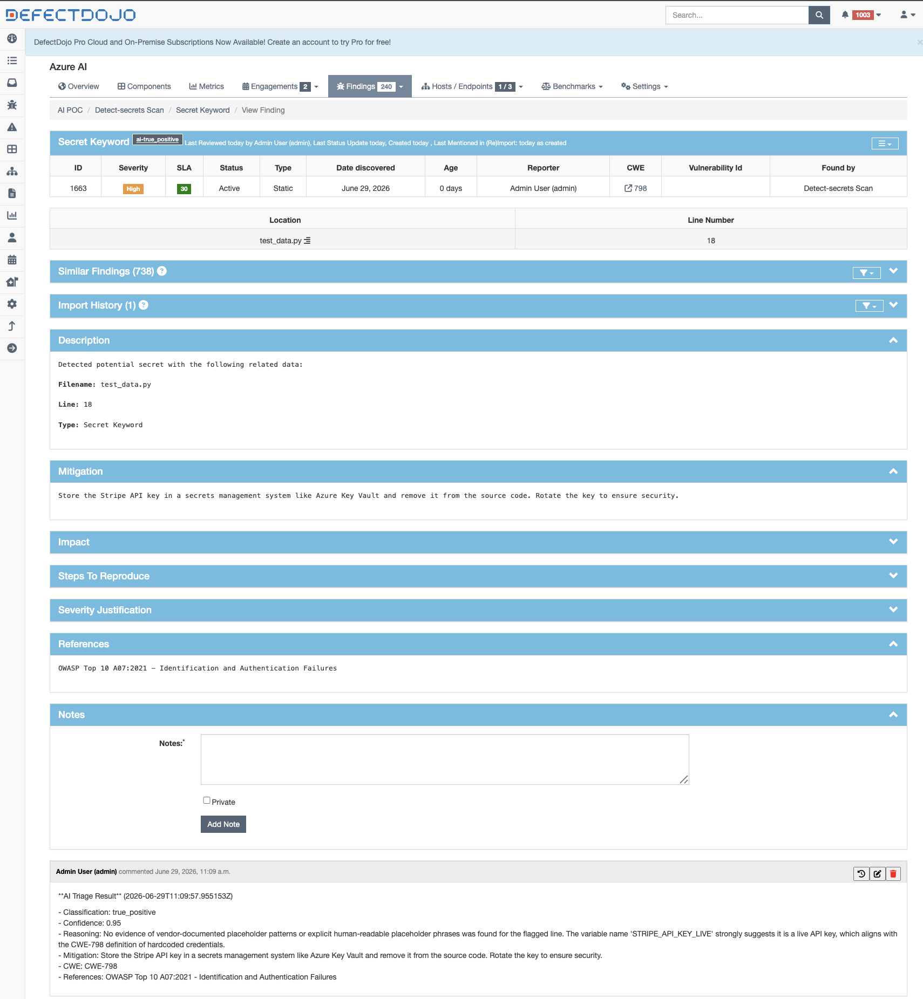
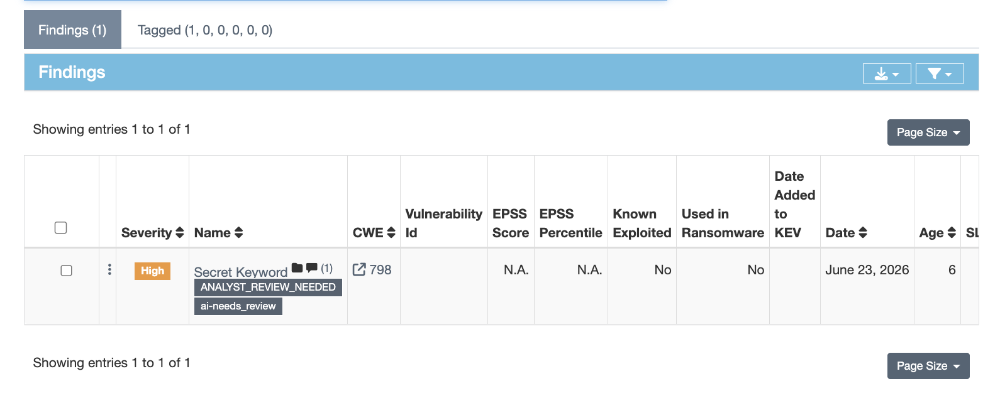
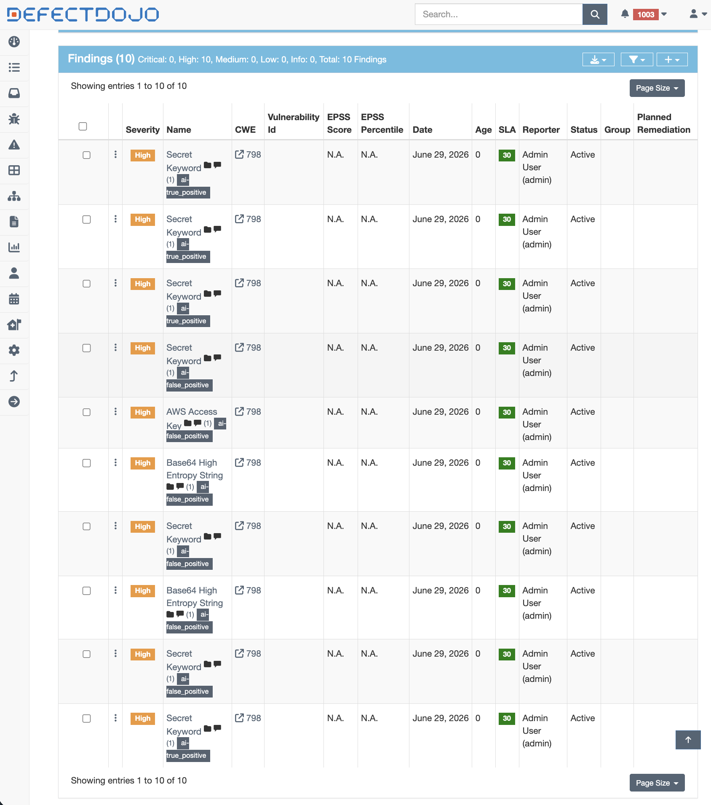
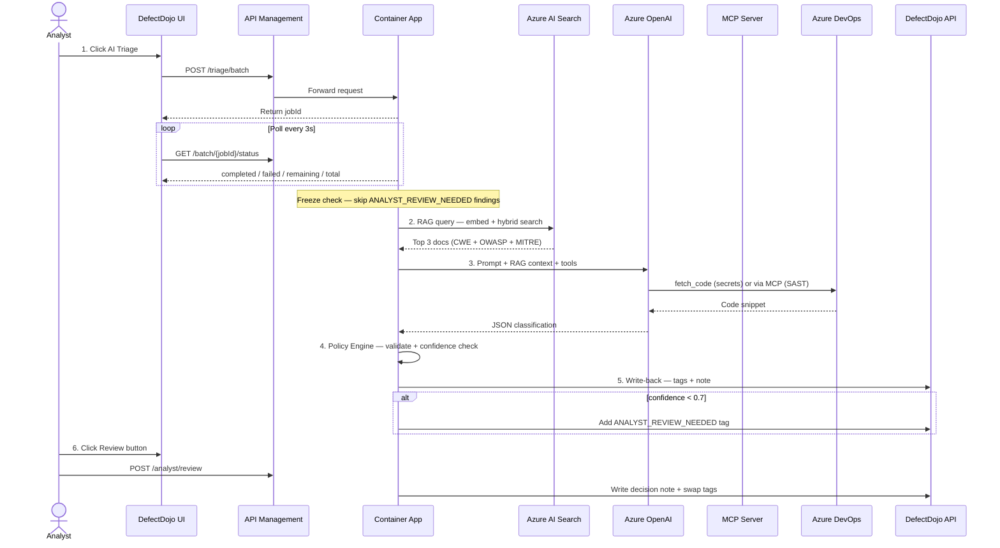
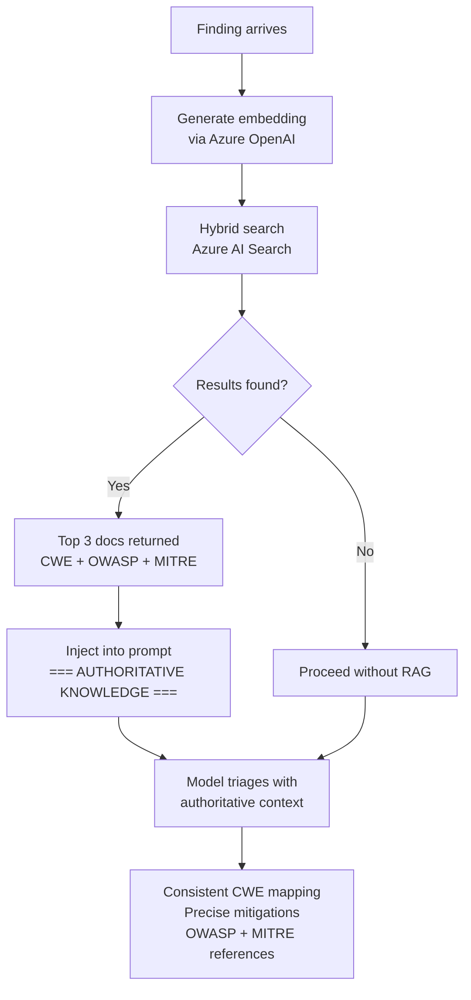

# DefectDojo AI Triage

> **Agentic AI-powered security finding triage for DefectDojo — fully automated, RAG-augmented, analyst-reviewable.**

[](https://opensource.org/licenses/MIT)
[](https://azure.microsoft.com/en-us/products/container-apps)
[](https://defectdojo.com)

---

## What This Does

DefectDojo AI Triage is a production-ready pipeline that **automatically triages security findings** in DefectDojo using Azure OpenAI, an MCP (Model Context Protocol) server, and Azure AI Search. It supports detect-secrets and SAST findings today, with SCA, DAST, and IaC adapters designed for future extension.

**Key capabilities:**
- 🤖 **Agentic triage** — the model fetches code context from your repo before classifying
- 📚 **RAG-augmented** — authoritative CWE, OWASP Top 10, and MITRE ATT&CK knowledge injected into every prompt
- 🔒 **Analyst review workflow** — low-confidence findings flagged for human review with approve/override UI
- 🔄 **Freeze guard** — findings pending analyst review are blocked from re-triage
- 📊 **Live progress** — real-time batch progress with completed/failed/remaining/total counters
- 🔑 **Zero stored credentials** — Managed Identity + Azure Key Vault throughout

---

## Screenshots

### AI Triage in Progress

*Live progress overlay showing completed, failed, remaining and total findings*

### Finding with AI Triage Result

*Finding tagged with AI classification and detailed triage note written back*

### Analyst Review Modal

*Analyst Review modal — approve or override the AI decision*

### Findings List with AI Tags

*Findings list showing ai-true_positive, ai-false_positive and ANALYST_REVIEW_NEEDED tags*

---

## Architecture

```
On-Premises / CI                Azure Cloud
────────────────                ──────────────────────────────────────────────────
DefectDojo  ──────────────────► API Management
                                      │
                                      ▼
                                Container App (Triage)
                                  ├── Secrets Adapter ──► Azure OpenAI ◄── RAG (AI Search)
                                  │     └── fetch_code ──► Azure DevOps
                                  │
                                  └── SAST Adapter ────► Azure OpenAI ◄── RAG (AI Search)
                                        └── MCP Server
                                              ├── fetch_finding ──► DefectDojo API
                                              ├── fetch_code ──────► Azure DevOps
                                              └── fetch_related_file ► Azure DevOps
                                                        │
                                                        ▼
                                              Write-back ──► DefectDojo (tags + notes)
```

See [`docs/e2e-sequence.mermaid`](docs/e2e-sequence.mermaid) for the full end-to-end sequence diagram.

### MCP Server Tools

| Tool | Description |
|---|---|
| `fetch_finding` | Fetch full finding from DefectDojo (CWE, severity, description) |
| `fetch_code` | Fetch source file from ADO with context around flagged line |
| `fetch_related_file` | Fetch any related file (sanitizers, validators, upstream callers) |
| `fetch_epss` | **Live** — query FIRST.org API for CVE exploitation probability (0-1, next 30 days) |

### End-to-End Flow



### RAG Enrichment Flow



---

## Supported Adapters

| Adapter | Supported Test Types | Status |
|---|---|---|
| **Secrets** | `detect-secrets` | ✅ Production ready + RAG (CWE/KEV/MITRE) |
| **SAST** | `semgrep`, `codeql`, `bandit`, `sarif`, `sonarqube`, `checkmarx` | ✅ Production ready + RAG + EPSS |
| **SCA** | `dependabot`, `owasp-dependency-check` | 🔲 Stub — PRs welcome |
| **DAST** | `zap`, `burp` | 🔲 Stub — PRs welcome |
| **IaC** | `checkov`, `tfsec` | 🔲 Stub — PRs welcome |

---

## RAG Knowledge Base

Every finding is enriched with authoritative security knowledge before the model classifies it:

| Source | Coverage | Documents |
|---|---|---|
| **CWE** | Top 15 most common weaknesses | CWE-89, CWE-79, CWE-798, CWE-22, CWE-78, and more |
| **KEV** | CISA Known Exploited Vulnerabilities | 60 actively exploited CVEs fetched live from CISA |
| **MITRE ATT&CK** | AppSec-relevant techniques | T1190, T1552, T1059, T1078, T1110, T1530, T1071 |
| **EPSS** | Live exploitation probability | Queried live via FIRST.org API per CVE at triage time |
| **CSAF** | Vendor security advisories | Planned — PRs welcome |
| **Internal standards** | Your org's policies | Add your own via `rag/ingest.py` |

> **Why KEV instead of OWASP Top 10?** Based on community feedback from Danijel Milicevic (Head of Security & Quality Engineering @ DB InfraGO): *"OWASP Top 10 is a catch-all — good luck finding CVEs that don't map to Top 10. KEV is the right signal source."* OWASP A03 Injection alone maps to 50+ CWEs and adds noise rather than signal. KEV provides much higher fidelity since these are CVEs **actively being exploited right now** in the wild.

---

## Prerequisites

- Azure subscription
- DefectDojo instance (self-hosted or cloud)
- Azure DevOps repository containing your source code
- Azure CLI installed and authenticated (`az login`)
- Python 3.11+
- Docker

---

## Quick Start

### Step 1 — Clone the repo

```bash
git clone https://github.com/YOUR_USERNAME/defectdojo-ai-triage.git
cd defectdojo-ai-triage
```

### Step 2 — Deploy Azure infrastructure

**Option A — Bicep (recommended, one command):**

```bash
# Edit parameters first
nano infra/bicep/main.bicepparam   # fill in your values

# Deploy everything
az deployment group create \
  --resource-group rg-ai-triage \
  --template-file infra/bicep/main.bicep \
  --parameters infra/bicep/main.bicepparam
```

See [`infra/bicep/README.md`](infra/bicep/README.md) for full Bicep deployment guide.

**Option B — Shell script (step-by-step):**

```bash
cd infra
chmod +x deploy.sh
./deploy.sh \
  --resource-group rg-ai-triage \
  --location eastus \
  --prefix myorg
```

Both options create:
- Azure Container Registry
- Azure Container Apps environment + triage app + MCP server
- Azure API Management
- Azure OpenAI (gpt-4o + text-embedding-ada-002)
- Azure AI Search
- Azure Key Vault
- Azure Service Bus

### Step 3 — Configure environment variables

Copy the example env file and fill in your values:

```bash
cp infra/.env.example infra/.env
```

| Variable | Description | Example |
|---|---|---|
| `DD_BASE_URL` | DefectDojo base URL | `http://your-dojo-instance:8080` |
| `KEY_VAULT_URI` | Azure Key Vault URI | `https://kv-myorg.vault.azure.net/` |
| `AOAI_ENDPOINT` | Azure OpenAI endpoint | `https://aoai-myorg.openai.azure.com/` |
| `AOAI_DEPLOYMENT` | GPT-4o deployment name | `gpt-4o-triage` |
| `MCP_SERVER_URL` | Internal MCP server URL | `https://ca-mcp.internal...` |
| `SEARCH_ENDPOINT` | Azure AI Search endpoint | `https://srch-myorg.search.windows.net` |
| `SERVICE_BUS_NAMESPACE` | Service Bus namespace | `sb-myorg.servicebus.windows.net` |

### Step 4 — Store secrets in Key Vault

```bash
# DefectDojo API token
az keyvault secret set \
  --vault-name kv-myorg \
  --name dd-api-token \
  --value "YOUR_DEFECTDOJO_TOKEN"

# Azure DevOps PAT (read-only, Code scope)
az keyvault secret set \
  --vault-name kv-myorg \
  --name ado-pat \
  --value "YOUR_ADO_PAT"

# Azure AI Search admin key
az keyvault secret set \
  --vault-name kv-myorg \
  --name srch-admin-key \
  --value "YOUR_SEARCH_KEY"
```

### Step 5 — Build and push container images

```bash
# Triage app
az acr build \
  --registry acrmyorg \
  --image triage-app:latest \
  ./triage-app

# MCP server
az acr build \
  --registry acrmyorg \
  --image mcp-server:latest \
  ./mcp-server
```

### Step 6 — Ingest RAG knowledge base

```bash
pip install -r rag/requirements.txt
python3 rag/ingest.py \
  --search-endpoint https://srch-myorg.search.windows.net \
  --search-key YOUR_SEARCH_KEY \
  --aoai-endpoint https://aoai-myorg.openai.azure.com/ \
  --aoai-key YOUR_AOAI_KEY
```

### Step 7 — Patch DefectDojo template

```bash
# SSH into your DefectDojo host
ssh your-defectdojo-host

# Apply the template patch
cd /path/to/django-DefectDojo
patch -p1 < /path/to/defectdojo/view_test.patch

# Restart DefectDojo (Docker)
docker cp dojo/templates/dojo/view_test.html \
  django-defectdojo-uwsgi-1:/app/dojo/templates/dojo/view_test.html
docker restart django-defectdojo-uwsgi-1
```

---

## How It Works

### Triage Flow

1. **Trigger** — Click "AI Triage" in DefectDojo test view (bulk or selected findings)
2. **Freeze check** — Findings pending analyst review are skipped automatically
3. **RAG enrichment** — Azure AI Search returns top-3 authoritative docs (CWE + OWASP + MITRE)
4. **Agentic classification**:
   - *Secrets*: model fetches code from ADO, classifies with RAG context
   - *SAST*: model calls MCP server (fetch_finding → fetch_code → fetch_related_file), classifies with RAG context
5. **Policy engine** — Downgrades to `needs_review` if confidence < 0.7
6. **Write-back** — Tags, mitigation, and AI note written to DefectDojo finding
7. **Analyst flag** — Low-confidence findings tagged `ANALYST_REVIEW_NEEDED`

### Analyst Review Flow

1. Analyst sees orange "Review" button on flagged findings
2. Modal: Approve AI decision or Override (False Positive / Risk Accepted / Active)
3. Decision note written automatically to DefectDojo
4. Tags swapped: `ANALYST_REVIEW_NEEDED` → `ANALYST_REVIEWED`
5. All other finding tags preserved

---

## Configuration Reference

### Container App Environment Variables

| Variable | Required | Description |
|---|---|---|
| `DD_BASE_URL` | ✅ | DefectDojo base URL (no trailing slash) |
| `KEY_VAULT_URI` | ✅ | Azure Key Vault URI |
| `AOAI_ENDPOINT` | ✅ | Azure OpenAI endpoint |
| `AOAI_DEPLOYMENT` | ✅ | GPT-4o deployment name |
| `MCP_SERVER_URL` | ✅ | Internal MCP server URL |
| `SEARCH_ENDPOINT` | ✅ | Azure AI Search endpoint |
| `SEARCH_ADMIN_KEY` | ✅ | Azure AI Search admin key (via Key Vault) |
| `SERVICE_BUS_NAMESPACE` | ✅ | Service Bus namespace FQDN |

### Key Vault Secrets

| Secret Name | Description |
|---|---|
| `dd-api-token` | DefectDojo API token |
| `ado-pat` | Azure DevOps PAT (read-only, Code scope) |
| `srch-admin-key` | Azure AI Search admin key |

### ADO Configuration (in triage-app/main.py)

```python
ADO_ORG     = "YourOrg"
ADO_PROJECT = "YourProject"
ADO_REPO    = "YourRepo"
ADO_BRANCH  = "main"
```

---

## Extending with New Adapters

To add a new adapter (e.g. Dependabot/SCA):

1. Add routing in `process_finding_directly()`:
```python
elif any(x in test_type_name.lower() for x in ["dependabot", "owasp-dependency-check"]):
    return sca_adapter(finding)
```

2. Implement the adapter function:
```python
def sca_adapter(finding: dict) -> dict:
    enriched = {
        "finding_id": finding["id"],
        "adapter": "sca",
        "package_name": ...,
        "cve_id": ...,
        "severity": finding.get("severity", ""),
    }
    return _process_enriched_finding(enriched)
```

3. Add an SCA-specific prompt template following the same pattern as `SECRETS_PROMPT_TEMPLATE`.

---

## Adding Custom Knowledge to RAG

To add your organisation's internal security standards:

```python
# In rag/ingest.py, add to DOCS list:
{
    "id": "internal-policy-001",
    "source": "INTERNAL",
    "source_id": "POL-001",
    "severity_context": "High",
    "title": "Your Policy Title",
    "content": "Full policy description...",
    "mitigations": "Required controls and mitigations...",
}
```

---

## API Reference

| Endpoint | Method | Description |
|---|---|---|
| `GET /` | GET | Health check |
| `POST /triage/batch` | POST | Start batch triage job |
| `GET /batch/{job_id}/status` | GET | Poll batch job status |
| `POST /triage/{finding_id}` | POST | Triage single finding |
| `POST /analyst/review` | POST | Submit analyst review decision |

---

## Security Considerations

- **No credentials in code** — all secrets stored in Azure Key Vault, accessed via Managed Identity
- **No secret values logged** — secret values are always redacted before logging or sending to the model
- **Read-only ADO access** — PAT scoped to Code read only
- **Single replica** — prevents in-memory job state split across replicas (scale-out requires moving job state to Redis/Table Storage)
- **APIM subscription key** — all API calls require a valid subscription key

---

## Roadmap

- [ ] SCA adapter (Dependabot / OWASP Dependency-Check)
- [ ] DAST adapter (OWASP ZAP / Burp Suite)
- [ ] IaC adapter (Checkov / tfsec)
- [ ] NVD CVE live API tool
- [ ] 10PM daily scheduler trigger
- [ ] Job state persistence (Redis) for multi-replica scale-out
- [ ] Claude Sonnet support via Azure AI Foundry
- [ ] Jira write-back integration

---

## Publishing to GitHub

New to Git? See the step-by-step guide: [`docs/github-setup.md`](docs/github-setup.md)

It covers: creating a GitHub account, installing Git, pushing the project, and setting up automatic deployments with GitHub Actions.

## Contributing

Contributions are welcome. See [CONTRIBUTING.md](CONTRIBUTING.md) for guidelines.

---

## License

MIT — see [LICENSE](LICENSE).

---

## Author

Built by a Senior Enterprise Security Architect.
Contributions welcome — see [CONTRIBUTING.md](CONTRIBUTING.md).
